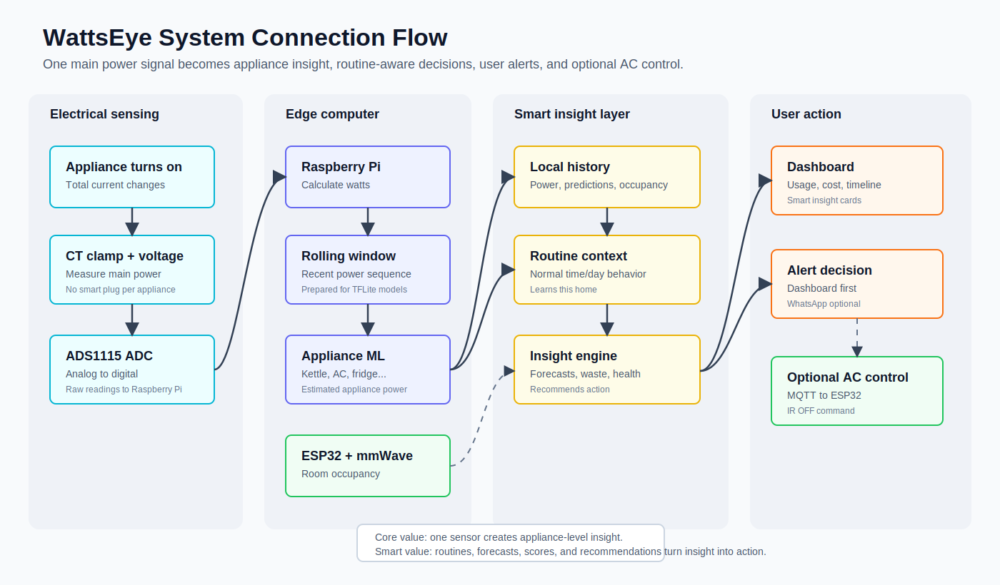

# 01 — System Connection: How Everything Connects

## 1. Purpose of this file

This file explains how all parts of WattsEye connect together.

This is the master map of the system.

By the end of this file, you should understand:

- What happens when an appliance turns on
- How the electricity sensor becomes data
- How the data goes into the AI model
- How routine and cost context become smart insights
- How the dashboard gets updated
- How the AC control and WhatsApp alert fit into the system

## 2. The full system flow

Visual reference:



```text
Appliance turns on
↓
Main wire current changes
↓
CT clamp senses the current change
↓
Signal conditioning circuit makes the signal safe and readable
↓
ADS1115 converts analog signal into digital numbers
↓
Raspberry Pi reads the numbers
↓
Raspberry Pi calculates power in watts
↓
Power readings are stored as a time sequence
↓
Machine learning models estimate appliance usage
↓
Dashboard updates
↓
If needed, WhatsApp alert or AC control is triggered
```

Important addition:

```text
The AI does not stop at appliance detection.
The Raspberry Pi also compares predictions with occupancy, time of day, past routines, and cost assumptions before deciding what insight or alert to show.
```

## 3. The main components

| Component | Simple role |
|---|---|
| CT clamp | Senses current from the main wire |
| Signal conditioning circuit | Makes the clamp signal safe for electronics |
| ZMPT101B voltage sensor | Measures mains voltage safely |
| ADS1115 | Converts analog signals into digital numbers |
| Raspberry Pi | Main brain: reads data, runs AI, serves dashboard |
| ESP32 | Helper controller: handles occupancy sensor and IR control |
| LD2410 mmWave sensor | Detects whether someone is in the room |
| IR LED + transistor | Sends AC remote-control signal |
| MQTT | Device communication system between Pi and ESP32 |
| Flask dashboard | Website shown on user phone/laptop |
| Twilio | Sends WhatsApp alerts |
| Local database | Stores historical readings, predictions, occupancy, alerts, and routines |

## 4. Hardware-to-software connection

The hardware does not directly “know” which appliance is on.

The hardware only measures the total electricity signal.

The software and AI interpret that signal.

```text
Hardware gives: total power over time
AI gives: estimated appliance breakdown
Smart insight engine gives: forecasts, waste alerts, health warnings, and recommendations
Dashboard gives: user-friendly display
```

## 5. Why one sensor can work

One sensor sees the total usage of the whole system.

Example:

```text
Base usage: 200W
Kettle turns on: total becomes 2200W
Kettle turns off: total returns to 200W
```

The AI does not need a separate sensor on the kettle. It learns that this kind of sudden 2000W jump looks like a kettle.

Different appliances create different power patterns:

| Appliance | Typical pattern |
|---|---|
| Kettle | Sudden high-power flat block |
| Fridge | Repeated on-off cycling |
| AC | Longer cycle, sometimes ramping or cycling |
| Microwave | High power with short active period |
| Washing machine | Multi-stage pattern |
| Phone charger | Low power, small pattern |

## 6. Raspberry Pi and ESP32 relationship

The system uses two computing boards because they have different strengths.

### Raspberry Pi

The Raspberry Pi is the main computer.

It handles:

- Reading power data
- Running AI models
- Hosting dashboard
- Storing data
- Sending WhatsApp requests
- Making higher-level decisions
- Learning household routines and generating smart insights

### ESP32

The ESP32 is the fast helper controller.

It handles:

- Reading the mmWave occupancy sensor
- Sending infrared commands to AC
- Receiving commands from the Raspberry Pi

## 7. Why not use only Raspberry Pi?

The Raspberry Pi can do many things, but it is not always best for fast sensor control and precise signal output.

The ESP32 is better for:

- Simple real-time sensor reading
- Controlling pins quickly
- Sending IR remote signals
- Staying responsive

So we use:

```text
Raspberry Pi = manager / brain
ESP32 = worker / hands
```

## 8. MQTT communication

MQTT is like a group chat for devices.

The Raspberry Pi runs the MQTT server, called Mosquitto.

The ESP32 joins this “chat.”

Example messages:

```text
ESP32 publishes: room/occupancy = empty
Pi publishes: ac/command = OFF
ESP32 receives OFF and sends IR signal
```

## 9. Example: kettle turns on

Step-by-step:

1. Kettle turns on.
2. Electricity usage increases quickly.
3. CT clamp senses a stronger magnetic field around the wire.
4. The clamp outputs a small signal.
5. The signal conditioning circuit makes it safe.
6. ADS1115 converts the signal into numbers.
7. Raspberry Pi reads the numbers.
8. Raspberry Pi calculates power in watts.
9. Power sequence shows a sudden jump.
10. Kettle model recognizes the pattern.
11. Dashboard shows kettle activity.

## 10. Example: AC left on in empty room

Step-by-step:

1. AC is running.
2. Power data shows AC-like usage.
3. mmWave sensor says nobody is in the room.
4. ESP32 sends occupancy status to Raspberry Pi.
5. Raspberry Pi decides this may be wasteful.
6. Raspberry Pi sends WhatsApp alert.
7. User replies yes.
8. Raspberry Pi sends MQTT command to ESP32.
9. ESP32 sends IR OFF signal.
10. AC turns off.

## 11. Where each subsystem begins and ends

### Electricity sensing subsystem

```text
CT clamp + voltage sensor + signal conditioning + ADS1115
```

Output:

```text
Current and voltage readings
```

### AI subsystem

```text
Power readings + rolling window + TFLite appliance models
```

Output:

```text
Predicted appliance usage
```

### Control subsystem

```text
mmWave sensor + ESP32 + MQTT + IR LED
```

Output:

```text
Occupancy status and AC control
```

### Smart insight subsystem

```text
Appliance predictions + occupancy + timestamped history + tariff assumptions
```

Output:

```text
Routine-aware alerts, bill forecasts, waste score, energy coach recommendations, and appliance health warnings
```

### User interface subsystem

```text
Flask dashboard + WhatsApp alerts
```

Output:

```text
What the user sees and responds to
```

## 12. Most important takeaway

WattsEye is not one single thing.

It is a chain:

```text
Sensor → data → AI → decision → user action
```

If one part is missing, the system becomes weaker.

But the most important proof is:

```text
Can one sensor produce useful appliance-level insight?
```
